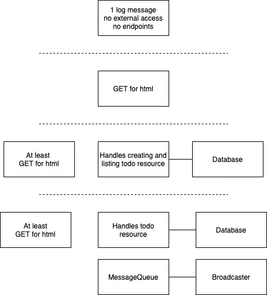

# DevOps with K8s - Part 1

## *Table of Contents*
---
1. [Exercise 1.02: Project v0.1](#102-project-v01)
1. [Exercise 1.04: Project v0.2](#104-project-v02)
1. [Exercise 1.05: Project v0.3](#105-project-v03)


## Overview
---

This project consist of making *to-do* app using Kubernetes (K8s) and simple MERN stack. 

Structure of this project should look something like this:



---
---


## *1.02: Project v0.1*
---

### **Objective**:
---

Using any language(s)/framework(s), create a web server that will:
- Output `Server started in port <####>` when it starts 
- Deploy it into Kubernetes cluster

*Note: Later exercises will be built off of this exercise.*

---

### **Solution**
---

Using `node` + `express`, I made [this](https://hub.docker.com/r/ruikawahara/web_server) Docker image.

Use following command to deploy into K8s cluster:

``` bash
# Start k3d... assuming you created cluster
k3d cluster start

# Deploy Docker image
kubectl create deployment web-server-dep --image=ruikawahara/web_server

# (optional) Check result
kubectl get deployments
kubectl logs -f <pod_name>
```
---


## *1.04: Project v0.2*
---

### **Objective**:
---

Create a deployment.yaml for the project.

---

### **Solution**
---

Run the following commands:

``` bash
# Deploy using deployment.yaml in this directory
kubectl apply -f manifests/deployment.yaml

# Check you result
kubectl get pods
kubectl get deployments
```
---

## 1.05: Project v0.3
---

### **Objective**:
---

Have the project respond something to a GET request sent to the project, such as simple html page. 

Use `kubectl port-forward` to confirm that the project is accessible and works in the cluster by using a browser to access the project

---

### **Solution**
---


``` bash
```